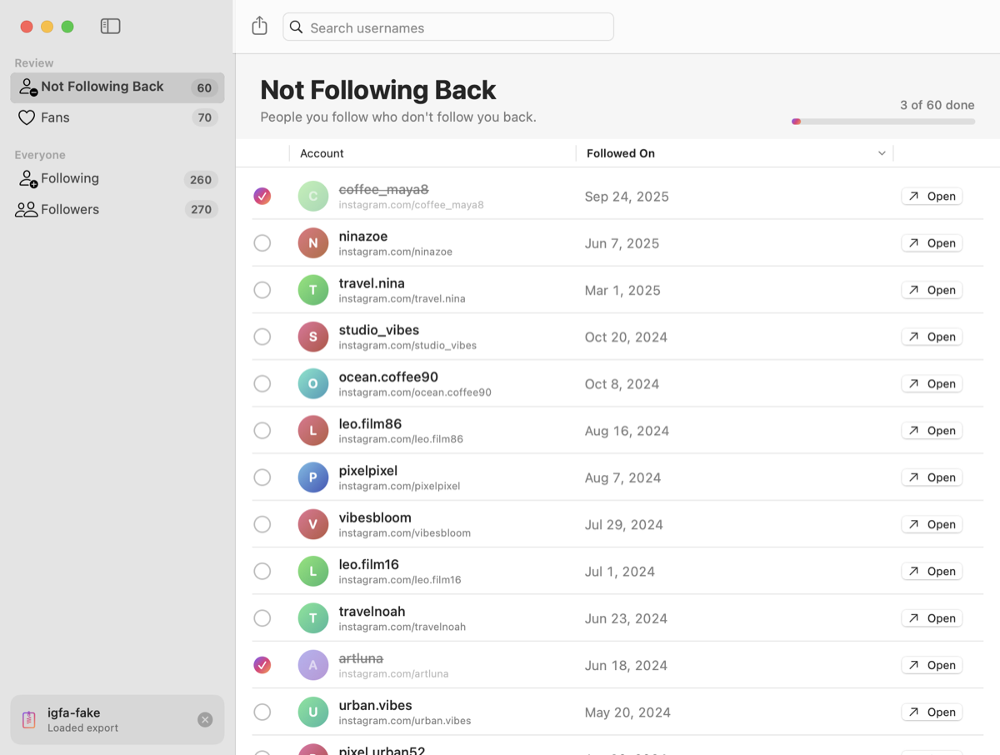

<p align="center">
  
</p>

<h1 align="center">IG Follow Audit</h1>

<p align="center">
  A small, offline Mac app that shows which Instagram accounts you follow don't follow you back,<br>
  using only the data export Instagram gives you.
</p>

> [!WARNING]
> **This entire project was vibecoded.**
> Every line of code, the tests, the icon and this README were written by an AI coding assistant ([Claude Code](https://claude.com/claude-code)) from plain-English prompts. The repository owner directed the work but did not write or review the code line by line.
>
> In practice that means:
> - The owner has tested it on their own real Instagram export, and it worked as expected. It hasn't had any wider testing beyond that.
> - There may be bugs nobody has noticed. Double-check before unfollowing anyone important.
> - It comes with **no warranty or support**. Use it at your own risk.
>
> See [How this was made](#how-this-was-made) for details.

<p align="center">
  
  
</p>
<p align="center"><sub>Screenshots use made-up sample accounts.</sub></p>

## What it does

You request your data from Instagram, drop the `.zip` onto the app, and it compares the people you follow with the people who follow you:

```
following  −  followers  =  people who don't follow you back
```

- **Not Following Back:** accounts you follow that don't follow you.
- **Fans:** accounts that follow you that you don't follow back.
- **Following / Followers:** the full lists.
- Search, sort by name or date, and tick accounts off as you go. Progress is saved between launches.
- Open a profile in your browser, copy usernames, or export any list as CSV.

The app **never logs in to Instagram and never unfollows anyone**. It only shows you a list. You do any unfollowing yourself in the Instagram app.

> [!NOTE]
> **Deactivated accounts show up too.** Instagram's export still lists accounts that have been deactivated, so the app shows them like any other account. They usually land in **Not Following Back**, because a deactivated account can't follow you. The export doesn't say which accounts are deactivated, and the app is offline, so it can't tell them apart. If **Open** takes you to Instagram's "Sorry, this page isn't available" page, the account is probably deactivated or deleted.

## Privacy

- **No network access.** The app runs in the macOS App Sandbox without the network permission, so macOS itself blocks it from connecting to anything.
- **Only the files you pick.** It can read only the export you drop or choose, and write only where you save a CSV.
- **Nothing is uploaded or collected.** The only thing it stores is the list of usernames you've ticked off, kept in the app's local preferences.

Your export contains personal data, so keep it out of git. The `.gitignore` already excludes `data/`, `*.zip` and the export's JSON files. Keeping exports in `data/` is the safest option.

## Getting your Instagram export

1. In Instagram, go to **Settings → Accounts Center → Your information and permissions → Download your information**.
2. Choose **Some of your information** and select only **Followers and following**.
3. Pick **Download to device**, with **Format: JSON** and **Date range: All time**.
4. Wait for Instagram's email (anywhere from minutes to a few hours), then download the `.zip`.

The app reads these files from the archive:

```
connections/followers_and_following/
├── followers_1.json   (large accounts get followers_2.json, … too)
└── following.json
```

If you picked **HTML** instead of JSON, the app will tell you. Request the export again in JSON.

## Install

There are no prebuilt downloads. You build it yourself, which takes about a minute.

**Requirements:** macOS 14 or later, and the Xcode Command Line Tools (full Xcode isn't needed):

```bash
xcode-select --install
```

**Build and run:**

```bash
git clone https://github.com/n1soryu/ig-follow-audit.git
cd ig-follow-audit
./scripts/build-app.sh
open "build/IG Follow Audit.app"
```

You can drag `build/IG Follow Audit.app` into `/Applications`. The app is about 2 MB.

It's ad-hoc signed, not notarized by Apple. If macOS won't open it the first time, right-click the app and choose **Open**.

## Using the app

1. Drop your export `.zip` (or the folder you extracted it to) onto the window, or click **Choose File…** (⌘O).
2. Pick a list in the sidebar.
3. Click **Open** (or double-click a row) to open the profile in your browser, then deal with it in Instagram.
4. Click the circle next to an account to mark it done. Right-click selected rows to copy usernames or mark several at once.
5. Use **Export CSV** in the toolbar to save the current list. Close the export with the ✕ at the bottom of the sidebar (⇧⌘W).

## How it works

- **Parsing:** Instagram has changed the export's layout over time. Older files put the username in `value`. Newer `following.json` files put it in `title`, with links like `instagram.com/_u/name`. The parser handles both and falls back to the profile link. Usernames are compared case-insensitively.
- **Reading the `.zip`:** a small built-in reader using Apple's Compression framework. No third-party dependencies, and no need to extract the archive first.
- **Comparison:** set difference in both directions, de-duplicated. Order follows the export.

## Development

```
Sources/FollowAuditCore/   export parsing, .zip reading, comparison (no UI)
Sources/IGFollowAudit/     the SwiftUI app
Tests/                     tests; fake exports are generated at runtime
Resources/                 Info.plist, sandbox entitlements, app icon
docs/screenshots/          README screenshots (sample data)
scripts/build-app.sh       builds and signs the .app
scripts/test.sh            runs the tests
scripts/make-icon.swift    regenerates Resources/AppIcon.icns
```

```bash
./scripts/test.sh   # 14 tests
swift run           # debug build, no sandbox
```

Quirks of building with only the Command Line Tools:

- **Use `./scripts/test.sh`, not plain `swift test`.** Plain `swift test` sometimes can't find the Swift Testing plugin. The script passes its path explicitly.
- **There's no `@State` in the views.** On current SDKs, SwiftUI's `@State` is a macro whose plugin only ships with full Xcode, so view state lives in the `@Observable` `AppModel` instead.

**UI snapshots:** debug builds can render the window to PNGs (light and dark) without Screen Recording permission. The screenshots above were made this way:

```bash
IGFA_SNAPSHOT=/tmp/shots IGFA_EXPORT=/path/to/sample-export swift run
```

## Known limitations

- Deactivated accounts can't be detected or filtered out (see the note under [What it does](#what-it-does)).
- Tested on one person's real export, on one Mac.
- macOS only.
- If Instagram changes the export format again, parsing may break.
- No notarization, so you get Gatekeeper's first-launch prompt.

## How this was made

This project was built in a few conversational sessions with [Claude Code](https://claude.com/claude-code), Anthropic's AI coding assistant. The owner described what they wanted: an offline Mac app based only on the official export, then a nicer UI and an icon. The AI planned it, wrote and tested the code, designed the UI and icon, wrote the docs and made the commits. Commits carry a `Co-Authored-By: Claude` trailer.

What was actually checked:

- The automated tests pass. They use generated fake exports in both Instagram layouts, plus zip and folder variants and error cases.
- The app builds, launches, and runs sandboxed.
- The UI was checked using rendered screenshots of sample data.
- The owner ran it on their own real Instagram export, and the results were correct. That's also how we learned that deactivated accounts appear in the lists.

What was **not** done: a human code review, or testing with other people's exports, on other Macs or on other macOS versions. Treat it accordingly.

## Credits

- App icon glyph: [Lucide](https://lucide.dev) "user-round-search", ISC License (see [`Resources/Icon/LUCIDE-LICENSE.txt`](Resources/Icon/LUCIDE-LICENSE.txt)).
- Not affiliated with, endorsed by, or connected to Instagram or Meta. "Instagram" is a trademark of Meta Platforms, Inc.

## License

Private, for personal use.
